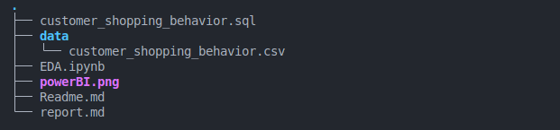
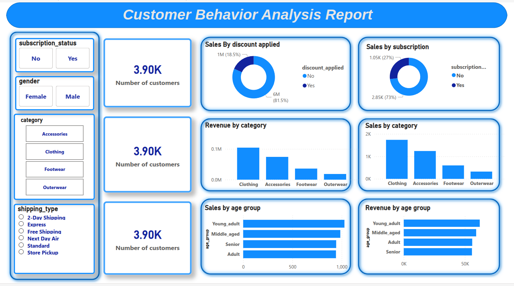

# CRM Analytics Dashboard – Customer Behavior Analysis

This project focuses on analyzing customer purchasing behavior using a structured dataset containing demographic and transactional information. The insights generated guide business decisions, improve targeting, and support retail analytics.

---

## Project Structure

A snapshot of the project directory:

**Key files:**

- `report.md` – Full detailed technical report  
- `powerBI.png` – Screenshot of the Power BI dashboard  
- `data/` – Dataset files (if included)  
- `notebooks/` – Optional exploratory notebooks

---

## Dataset Description

The project uses customer transaction data with the following fields:

| Feature | Description |
|---|---|
| `customer_id` | Unique identifier for each customer |
| `age` | Customer age |
| `gender` | Gender (Male/Female/Other) |
| `item_purchased` | Name of the purchased item |
| `category` | Product category (e.g., electronics, food, etc.) |
| `purchase_amount_usd` | Transaction amount |
| `discount_applied` | Whether a discount was applied (Yes/No) |
| `shipping_type` | Shipping method |
| `subscription_status` | Whether the customer is subscribed |

---

## Objectives

- Identify purchasing behavior trends across customer segments.
- Provide actionable insights for strategic decisions such as:
  - Marketing targeting
  - Product assortment optimization
  - Customer experience improvements

---

## Key Business Questions Answered

- Which customer segments contribute the most purchases?
- What product categories are most popular among different demographics?
- Which age or gender groups are most profitable?
- Are there noticeable differences in preferences across segments?

---

## Process Overview

1. **Data Importing & Cleaning**
   - Loaded raw dataset
   - Handled missing data
   - Standardized and validated data formats

2. **Exploratory Data Analysis (EDA)**
   - Generated descriptive statistical summaries
   - Performed segment-based breakdowns

3. **Segmentation**
   - Customers analyzed across age groups, gender, and product category

4. **Insights & Visualization**
   - Designed a Power BI dashboard for stakeholder-friendly interpretation

---

## Dashboard

A Power BI dashboard was developed to visualize:

- Customer segment distributions
- Category-wise product preferences
- Top selling products
- Demographic insights

### Screenshot

---

## Full Report

A comprehensive technical report detailing the steps, methodology, analysis, and business conclusions can be found here:

👉 [report.md](report.md)

---

## Tools & Technologies

- **Python / Pandas / NumPy** – Data processing
- **Power BI** – Visualization & dashboard
- **Jupyter Notebook** (optional) – Exploratory analysis
- **SQL / PostgreSQL** – Data querying and aggregation

---

## Author

**Ahmed Elgammal**
